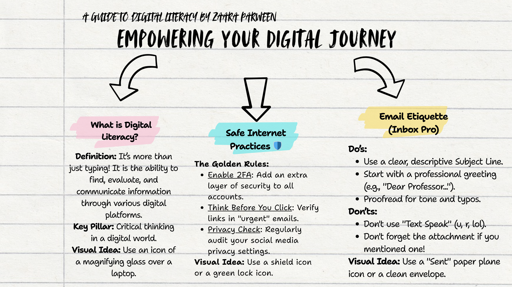

# Student Digital Ambassador 

## 🎨 Task 1: Digital Literacy Awareness Infographic

### 🖼️ Project Visual

### ✍️ Project Report
For this initial task, I designed a comprehensive infographic focused on **Digital Literacy Awareness**. The goal was to create a visually engaging and easy-to-understand resource for my peers to navigate the digital world safely and effectively.

**Key Topics Covered:**
* **Online Safety:** How to identify phishing and secure personal data.
* **Digital Etiquette:** Proper "Netiquette" for professional communication.
* **Digital Footprint:** Understanding the long-term impact of our online actions.
* **Information Literacy:** Fact-checking and identifying credible online sources.

**Tools Used:**
I utilized **Canva** to design the infographic, ensuring it met professional design standards while remaining accessible to a student audience. This task allowed me to practice translating complex digital concepts into clear, actionable advice—a core responsibility of a **Student Digital Ambassador**.

---

## 🎨 Task 2: Professional Online Presence & Personal Branding

### 🌐 Profile Links
* **LinkedIn:** [My Professional Profile](www.linkedin.com/in/zaara-parween-84a8b5372)
* **Kaggle:** [My Data Science Portfolio](https://www.kaggle.com/zaaraparween)
* **GitHub:** [My Coding Repository](https://github.com/zaara03012007-shark)

### 📸 Portfolio Screenshots

### ✍️ Task 2 Project Report
For this task, I focused on building a cohesive professional brand across major technical and networking platforms. I optimized my **LinkedIn** profile with a custom banner and professional summary to connect with industry leaders. I also established a **Kaggle** account to engage with the data science community and organized this **GitHub** repository to showcase my technical projects. This "digital footprint" is essential for my career as a Student Digital Ambassador, as it demonstrates my ability to maintain a professional and influential online presence.

----

## 🚀 Task 3: Explore Coding & Collaboration Platforms

### 🔗 Project Links
* **Digital Literacy Awareness Quiz (Google Form):** [Click Here to View the Form](https://forms.gle/igSa5gchVBARfGZX8)

### 📊 Platform Screenshots

### ✍️ Project Report (Requirement #15)
For this task, I explored two critical categories of digital tools: coding practice platforms and cloud collaboration suites. 

**What I Built and Practised:**
I utilized **HackerRank** to complete the "Say Hello, World! With Python" challenge, which served as a practical exercise in syntax and compiler interaction. For the collaboration component, I developed a **Digital Literacy Awareness Quiz** using Google Forms, featuring a mix of multiple-choice and short-answer questions. I successfully linked this form to a **Google Sheet** to automate response tracking and data organization.

**Academic & Professional Benefits:**
As a B.Tech CSE student, these tools are essential for my academic and career growth. HackerRank prepares me for technical placements and sharpens my problem-solving logic. Google Workspace, on the other hand, is a vital skill for group projects and research, allowing for seamless real-time collaboration with my batchmates. Mastering these platforms as a Digital Ambassador allows me to provide better guidance to my peers, fostering a more organized and technically proficient student community.

---

## Task 4: The Impact of Poor Digital Communication

The Scenario:
A common yet serious instance of poor digital communication is the "Reply-All" data breach. In a hypothetical college scenario, a student might send an email containing sensitive personal documents or a private grievance to an administrator, but accidentally hits "Reply-All," broadcasting that private information to the entire department. This causes immediate reputational damage and a breach of privacy that is impossible to "undo" once the email is sitting in hundreds of inboxes.

What could have been done differently:
This situation could have been avoided by practicing better email etiquette and "Pause before Posting" logic. The sender should have double-checked the "To" field before hitting send and used the BCC (Blind Carbon Copy) feature if they were part of a large thread. Additionally, using secure cloud-sharing links with restricted access—rather than attaching raw files—would have allowed the sender to revoke access once the mistake was realized. Mastering these professional communication standards is a core responsibility for any Digital Ambassador.

---

##🛡️ Task 5: Cybercrime Awareness & Prevention

What surprised me most:
While researching UPI fraud, I was surprised to learn how scammers exploit the psychological "rush" of receiving money to make victims ignore basic security logic. The fact that a QR code is technically a "Request for Money" and not a "Payment Voucher" is something many users—including tech-savvy students—often misunderstand. It highlighted that the weakest link in cybersecurity is often human psychology, not just software bugs.

Habit I will change:
Moving forward, I will strictly follow the "Zero Trust" policy for unsolicited links and QR codes. I have also committed to using a dedicated password manager to ensure I don't reuse passwords across different platforms. As a Digital Ambassador, I will actively educate my batchmates that a UPI PIN is strictly for sending money, never for receiving it
